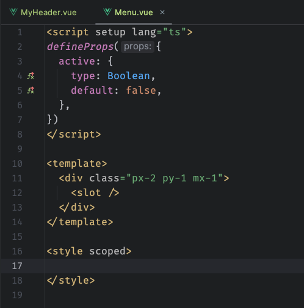
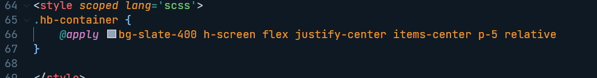

有插件可以格式化 tailwind 的 class 顺序吗，不然可能不同的组件写的 class 会比较乱

### 1.使用@apply

### 2.使用插件
使用对应的插件，也可以实现保存时自动格式化 

eslint:

https://www.npmjs.com/package/eslint-plugin-tailwindcss

prettier

https://github.com/tailwindlabs/prettier-plugin-tailwindcss