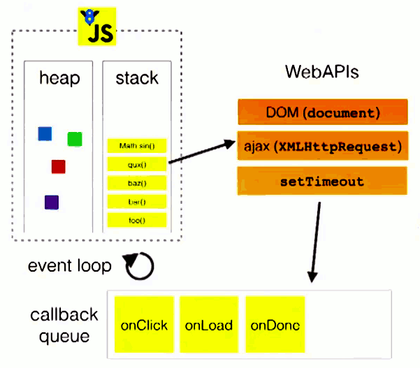

### 前言
javascript从诞生之日起就是一门单线程的非阻塞的脚本语言。这是由其最初的用途来决定的：与浏览器交互。

前面提到javascript的另一个特点是“非阻塞”，那么javascript引擎到底是如何实现的这一点呢？答案就是今天这篇文章的主角——event loop（事件循环）。

## 浏览器环境下js引擎的事件循环机制
### 1.执行栈与事件队列

当javascript代码执行的时候会将不同的变量存于内存中的不同位置：堆（heap）和栈（stack）中来加以区分。

我们知道，当我们调用一个方法的时候，js会生成一个与这个方法对应的执行环境（context），又叫执行上下文。这个执行环境中存在着这个方法的私有作用域，上层作用域的指向，方法的参数，这个作用域中定义的变量以及这个作用域的this对象。 而当一系列方法被依次调用的时候，因为js是单线程的，同一时间只能执行一个方法，于是这些方法被排队在一个单独的地方。这个地方被称为执行栈。

当一个异步代码（如发送ajax请求数据）执行后会如何呢？前文提过，js的另一大特点是非阻塞，实现这一点的关键在于下面要说的这项机制——事件队列（Task Queue）。

js引擎遇到一个异步事件后并不会一直等待其返回结果，而是会将这个事件挂起，继续执行执行栈中的其他任务。当一个异步事件返回结果后，js会将这个事件加入与当前执行栈不同的另一个队列，我们称之为事件队列。被放入事件队列不会立刻执行其回调，而是等待当前执行栈中的所有任务都执行完毕， 主线程处于闲置状态时，主线程会去查找事件队列是否有任务。如果有，那么主线程会从中取出排在第一位的事件，并把这个事件对应的回调放入执行栈中，然后执行其中的同步代码...，如此反复，这样就形成了一个无限的循环。这就是这个过程被称为“事件循环（Event Loop）”的原因。




### 2.macro task与micro task
以上的事件循环过程是一个宏观的表述，实际上因为异步任务之间并不相同，因此他们的执行优先级也有区别。不同的异步任务被分为两类：微任务（micro task）和宏任务（macro task）。

以下事件属于宏任务：
* setInterval()
* setTimeout()

以下事件属于微任务
* Promise.resolve().then()
* new MutaionObserver()

根据这个异步事件的类型，这个事件实际上会被对应的宏任务队列或者微任务队列中去。并且在当前执行栈为空的时候，主线程会 查看微任务队列是否有事件存在。如果不存在，那么再去宏任务队列中取出一个事件并把对应的回到加入当前执行栈；如果存在，则会依次执行队列中事件对应的回调，直到微任务队列为空，然后去宏任务队列中取出最前面的一个事件，把对应的回调加入当前执行栈...如此反复，进入循环。

**我们只需记住当当前执行栈执行完毕时会立刻先处理所有微任务队列中的事件，然后再去宏任务队列中取出一个事件。同一次事件循环中，微任务永远在宏任务之前执行**。

## node环境下的事件循环机制
### 1.与浏览器环境有何不同?
在node中，事件循环表现出的状态与浏览器中大致相同。不同的是node中有一套自己的模型。node中事件循环的实现是依靠的libuv引擎。我们知道node选择chrome v8引擎作为js解释器，v8引擎将js代码分析后去调用对应的node api，而这些api最后则由libuv引擎驱动，执行对应的任务，并把不同的事件放在不同的队列中等待主线程执行。 因此实际上node中的事件循环存在于libuv引擎中。

### 2.事件循环模型
下面是一个libuv引擎中的事件循环的模型:

```text
┌───────────────────────┐
┌─>│        timers         │
│  └──────────┬────────────┘
│  ┌──────────┴────────────┐
│  │     I/O callbacks     │
│  └──────────┬────────────┘
│  ┌──────────┴────────────┐
│  │     idle, prepare     │
│  └──────────┬────────────┘      ┌───────────────┐
│  ┌──────────┴────────────┐      │   incoming:   │
│  │         poll          │<──connections───     │
│  └──────────┬────────────┘      │   data, etc.  │
│  ┌──────────┴────────────┐      └───────────────┘
│  │        check          │
│  └──────────┬────────────┘
│  ┌──────────┴────────────┐
└──┤    close callbacks    │
└───────────────────────┘
```

### 3.事件循环各阶段详解
外部输入数据-->轮询阶段(poll)-->检查阶段(check)-->关闭事件回调阶段(close callback)-->定时器检测阶段(timer)-->I/O事件回调阶段(I/O callbacks)-->闲置阶段(idle, prepare)-->轮询阶段...

这些阶段大致的功能如下：

* timers: 这个阶段执行定时器队列中的回调如 setTimeout() 和 setInterval()。
* I/O callbacks: 这个阶段执行几乎所有的回调。但是不包括close事件，定时器和setImmediate()的回调。
* idle, prepare: 这个阶段仅在内部使用，可以不必理会。
* poll: 等待新的I/O事件，node在一些特殊情况下会阻塞在这里。
* check: setImmediate()的回调会在这个阶段执行。
* close callbacks: 例如socket.on('close', ...)这种close事件的回调。

#### poll阶段
当个v8引擎将js代码解析后传入libuv引擎后，循环首先进入poll阶段。poll阶段的执行逻辑如下： 先查看poll queue中是否有事件，有任务就按先进先出的顺序依次执行回调。 当queue为空时，会检查是否有setImmediate()的callback，如果有就进入check阶段执行这些callback。但同时也会检查是否有到期的timer，如果有，就把这些到期的timer的callback按照调用顺序放到timer queue中，之后循环会进入timer阶段执行queue中的 callback。 这两者的顺序是不固定的，收到代码运行的环境的影响。如果两者的queue都是空的，那么loop会在poll阶段停留，直到有一个i/o事件返回，循环会进入i/o callback阶段并立即执行这个事件的callback。

值得注意的是，poll阶段在执行poll queue中的回调时实际上不会无限的执行下去。有两种情况poll阶段会终止执行poll queue中的下一个回调：1.所有回调执行完毕。2.执行数超过了node的限制。

#### check阶段
check阶段专门用来执行setImmediate()方法的回调，当poll阶段进入空闲状态，并且setImmediate queue中有callback时，事件循环进入这个阶段。

#### timer阶段
这个阶段以先进先出的方式执行所有到期的timer加入timer队列里的callback，一个timer callback指得是一个通过setTimeout或者setInterval函数设置的回调函数。

#### close阶段
当一个socket连接或者一个handle被突然关闭时（例如调用了socket.destroy()方法），close事件会被发送到这个阶段执行回调。否则事件会用process.nextTick（）方法发送出去。

#### I/O callback阶段
如上文所言，这个阶段主要执行大部分I/O事件的回调，包括一些为操作系统执行的回调。例如一个TCP连接生错误时，系统需要执行回调来获得这个错误的报告。

### 4.process.nextTick,setTimeout与setImmediate的区别与使用场景
在node中有三个常用的用来推迟任务执行的方法：process.nextTick,setTimeout（setInterval与之相同）与setImmediate

区别：

#### process.nextTick()
尽管没有提及，但是实际上node中存在着一个特殊的队列，即nextTick queue。这个队列中的回调执行虽然没有被表示为一个阶段，当时这些事件却会在每一个阶段执行完毕准备进入下一个阶段时优先执行。当事件循环准备进入下一个阶段之前，会先检查nextTick queue中是否有任务，如果有，那么会先清空这个队列。与执行poll queue中的任务不同的是，这个操作在队列清空前是不会停止的。这也就意味着，错误的使用process.nextTick()方法会导致node进入一个死循环。。直到内存泄漏。

那么合适使用这个方法比较合适呢？下面有一个例子：
```js
const server = net.createServer(() => {}).listen(8080);

server.on('listening', () => {});
```
这个例子中当，当listen方法被调用时，除非端口被占用，否则会立刻绑定在对应的端口上。这意味着此时这个端口可以立刻触发listening事件并执行其回调。然而，这时候on('listening)还没有将callback设置好，自然没有callback可以执行。为了避免出现这种情况，node会在listen事件中使用process.nextTick()方法，确保事件在回调函数绑定后被触发。

#### setTimeout()和setImmediate()
在三个方法中，这两个方法最容易被弄混。实际上，某些情况下这两个方法的表现也非常相似。然而实际上，这两个方法的意义却大为不同。

setTimeout()方法是定义一个回调，并且希望这个回调在我们所指定的时间间隔后第一时间去执行。注意这个“第一时间执行”，这意味着，受到操作系统和当前执行任务的诸多影响，该回调并不会在我们预期的时间间隔后精准的执行。执行的时间存在一定的延迟和误差，这是不可避免的。node会在可以执行timer回调的第一时间去执行你所设定的任务。

setImmediate()方法从意义上将是立刻执行的意思，但是实际上它却是在一个固定的阶段才会执行回调，即poll阶段之后。有趣的是，这个名字的意义和之前提到过的process.nextTick()方法才是最匹配的。node的开发者们也清楚这两个方法的命名上存在一定的混淆，他们表示不会把这两个方法的名字调换过来---因为有大量的node程序使用着这两个方法，调换命名所带来的好处与它的影响相比不值一提。


