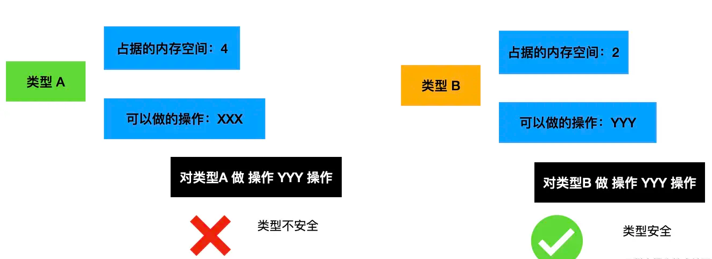

我们常说js拥有多钟数据类型，number，string，Boolean等
它们其实是编程语言对不同内容的抽象，何为抽象？你可以理解为：
```js
let name = new String('lee')
console.log(name) //lee
```
能把我们需要形如lee声明为一个字符串，这样一个阶段就是字符串类型的抽象，也就是new String所做的。什么? let name = '123'不就行了吗，但这其实是语法糖

因此，不同类型的抽象对应的内存大小和可做的操作都是不同的，因此，我们知道了什么是类型，那自然可以想到类型和所做的操作要匹配才行，这就是为什么要做**类型检查**

如果能保证对某种类型只做该类型允许的操作，这就叫做**类型安全**。例如你对boolean进行加法运算，这就是类型使用的不安全。

所以，类型检查是为了保证类型安全的。



类型检查可以在运行时做，也可以运行之前的编译期做。这是两种不同的类型，前者叫做动态类型检查，后者叫做静态类型检查。

两种类型检查各有优缺点。

### 动态类型检查：
#### 优点
在源码中不保留类型信息，对某个变量赋什么值、做什么操作都是允许的，写代码很灵活

#### 缺点
类型不安全的隐患，比如对 string 做了乘除，对 Date 对象调用了 exec 方法，这些都是运行时才能检查出来的错误


### 静态类型检查
#### 优点
源码中保留类型信息，声明变量要指定类型，对变量做的操作要和类型匹配，会有专门的编译器在编译期间做检查

#### 缺点
增加编写难度，增加心智负担
