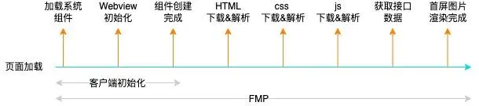

## 为什么要做优化？

Global Web Performance Matters for ecommerce的报告中指出

* 47%的用户更在乎网页在2秒内是否完成加载。
* 52%的在线用户认为网页打开速度影响到他们对网站的忠实度。
* 每慢1秒造成页面 PV 降低11%，用户满意度也随之降低降低16%。
* 近半数移动用户因为在10秒内仍未打开页面从而放弃。

### 指标选择
衡量秒开的指标 FMP，用户从点击打开一个webview到首屏内容完整的展现

## 常用的加速方法
通常的 web 优化方法，基本围绕在`资源加载`和 `html 渲染`两个方面。

前者针对首屏，后者针对可交互。资源优化上，我们总的方向是围绕更小的资源包上，比如常见的：`压缩`、`减包`、`拆包`、`动态加载包`及`图片优化`。html 渲染上总的方向是更快地展示内容，比如通过` cdn 分发`、`dns 解析`、`http 缓存`、`数据预请求`，`数据缓存`及首屏优化大杀器——`直出`等

具体可以去看同目录(前端优化/白屏时间.md)

## 常见的hybrid h5优化方案
### 容器化无缝切换方案
正常 web 页面关闭后，webview 组件即会销毁掉，下一次再打开需要重新启动。通常让 `webview` 保持常驻的做法可以节省 webview 启动时间， 但简单的常驻 webview 并不能做到页面秒开，页面打开仍然需要重新解析 html。

对于我们的应用特征而言，页面切换实际上是仅仅内容数据的变化，比如切换一篇文档，其 html 容器及样式都是同一套，而差异仅仅只是在数据上，重新载入 html 及初始化 js 这部分耗时完全可以避免掉。让 webview 组件及其容器内的 html 页面常驻，在文档切换的过程，仅仅对数据进行替换，这既是容器化方案。容器化方案省去了 webview 重复启动和渲染 html 的问题，打开文档，耗时只在做数据替换，真正做到了秒开。

1. `容器切换`

首先在 app 打开的时候，文档列表会进行数据预拉取，同时触发客户端预启动容器。容器内会提前进行 html 渲染和 js 执行，此时的数据是空的。用户点击文档，客户端会对打开 url 这一行为进行监听，同时解析 url，取出唯一标识符， 判断本地是否已经存在并且符合要求的数据，如果条件命中，直接使用已经打开的容器切出，通知到容器内的 web，web 收到通知，通过 url 取出标识符，从本地进行数据获取，然后对数据进行替换渲染，从而完成页面切换。

2. `容器化数据替换`

前端项目代码设计都是自执行调用方式，支持容器化的前提是：需要对代码改造成可支持数据组装和销毁。

通过`依赖倒置`（依赖倒置原则的是指内部模块不应该依赖外部模块，底层模块不应该依赖上层模块），职责链模式（职责链模式是指每个对象都有接受请求的可能，这些对象连接成一条链，请求沿着这条链的传递，直到有对象处理，这样做的好处是减少接受者和发送者直接的耦合），依赖注入（如同nestjs一样的AOP模式，让依赖以参数的形式注入需要的模块）

3. `数据预拉服务`

在整个数据预拉的过程，我们是通过一套独立的客户端后台 webview 服务执行具体任务，独立服务的好处是让各种容器化基础服务和文档管理列表本身进行解耦，同时将拉取、解析、储存数据这一对性能有消耗的过程放后台服务，减少了列表用户交互界面层的性能压力。

另一方面，作为多端公用的一个服务，构建流程上单独部署，更新代码的时候能够不依赖其他页面，变得更灵活。

4. `数据快照`

对于纯 dom 结构的文档型品类，我们会在打开文档，解析数据后，把生成的 html 缓存在本地数据库一张快照表里。下一次切换容器时，在取本地数据去解析的同时，会判断对应 id 在快照表是否存在缓存，如果有，直接取出来，覆盖在 html 上，用户可以提前看到上一次渲染的数据，等本地数据真正解析完，再展示可交互界面

5. `预创建`

思路和数据预拉取一样，在用户进入文档首页的同时，我们会提前预请求一批创建 id，然后缓存到本地，同时根据创建 id 生成一篇空白文档数据，储存在本地，用户点击新建，就可以从本地上取一个未使用的url，直接用容器切换打开

`优点`：省去了 webview 重复启动和渲染 html 的问题，达到秒开

`缺点`：app 内存占用上会比未使用容器化方案要大非常多

### 直出+离线包缓存
`直出`是指后台渲染带首屏数据的 HTML 文档，客户端加载 HTML 后，再请求 JS/CSS 更新数据等。

不同类型的主流框架（vue和react），都会有一套后台渲染方案，比如 vue-server-renderer、react-dom/server 等。`直出`省去了前端渲染，及 ajax 请求的时间，虽然直出能够通过各种缓存策略优化得很好，但加载 html 仍然需要时间

`离线包`是将 JS/HTML/CSS 以及数据都`缓存`到本地，客户端创建 `Webview` 统一拦截 url，将资源映射到本地离线包，异步请求最新数据，回填至页面上

`优点`：相对透明，侵入性非常小；`缺点`：Webview 初始化耗时；数据量庞大的 HTML 解析也很耗时；直出方案中获取更新数据是串行的

### 客户端代理
在 h5 中，用户从点击到看见页面之间，上面提到的缺点， webview 初始化，请求资源的时间，而这里的过程是串行的。

`VasSonic` 是腾讯增值会员团队研发的一个轻量级 hybrid 框架，支持上面提到的离线包策略，更进一步的是，它还做了以下优化：

* webview 初始化和通过客户端代理资源请求并行
* 流式拦截请求，边加载边渲染
* 实现了动态缓存和增量更新。

客户端代理资源请求即提前请求 HTML 并缓存到本地，等 Webview 线程发起相应资源的请求时，直接返回本地的缓存。

动态缓存和增量更新是建立在强代码侵入性的基础上的。通过`自定义 HTML 注释`区分`动态数据`和`模板数据`，拓展 HTTP 头部与后台约定具体页面。请求时，通过 ID 判断具体页面是否需要更新数据，后台将差异部分通过 JS 回调在客户端局部更新

`优点`：性能较高；`缺点`：代码入侵性强，接入的工作量及维护成本会非常大

### PWA+直出+预加载
不管是离线包技术，还是 webview 代理请求，都是对前端侵入非常大的，pwa 作为 web 标准，能够通过纯 web 的方案去加速和优化加载性能。

首先，pwa 的能够通过 `cacheStorage` 缓存普通的图片、js、css 资源。

由于 pwa 可精细化控制缓存,使用了 `pwa` 的 html 页面可以直接缓存呢？

对于直出 html，我们可以配合 `pwa`，将从后台直出的文件，缓存到 `cacheStorage`，在下一次请求时，优先从本地缓存中获取，同时发起网络请求更新本地 html 文件。

但是在 hybrid 的 h5 应用，第一次启动的加载资源仍然费时，我们可以通过 app 端上支持预加载一个 javascript 脚本，拉取需要 PWA 缓存的页面，可以提前完成缓存。

对于非直出的页面，我们仍然无法避免浏览器渲染 html 时间的问题，应该如何减少这里的时间呢？

这里明确两个点，第一次永远只能靠提前加载，所以上面的借助端上预加载脚本仍然生效；第二点非直出页面，每个页面需要有独一无二的标记，比如 hash。浏览器获取到数据，并且渲染好的 html，能够通过 `outerHTML` 方法，将 html 页面缓存到 `cacheStorage` 中，第二次访问优先从本地获取，同时发起 html 请求，通过对比其中唯一标识的差异，决定是否需要更新。

`优点`：pwa 一系列方案替代离线包策略，带来的好处是，属于 web 标准，适用于普通能够支持 service-worker 的 H5 页面

### NSR 渲染
GMTC2019 全球大前端技术上 UC 团队提到了 0.3 秒的 “闪开” 方案。NSR 就是前端版本的 SSR，非常具有启发性。

其核心思路是，借助浏览器启用一个 `JS-Runtime`，提前将下载好的 html 模板及预取的 `feed` 流数据进行渲染，然后将 html 设置到内存级别的 `MemoryCache` 中，从而达到点开即看的效果。

`优点`：`NSR` 将 SSR 渲染的过程分发到了各个用户的端中，在减少了后台请求压力的同时，也加进一步快了页面打开速度

`缺点`：数据预取和预渲染带来额外的流量和性能开销

### 小程序化
小程序生态不管从加载速度还是页面流畅度小程序都要高于 H5 页面，其原因是通过在架构上对开发进行规范化和约束化，小程序内部将 webview 渲染和 js 执行分离开来，然后通过离线包，页面拆分，预加载页面等一系列优化手段，让小程序天然具备了大量的 H5 优化后的效果。

hybrid 开发，通过原生客户端底层支持这种小程序环境，然后大量业务逻辑采用小程序方案开发，来达到迭代速度与性能兼并的效果

> 引用-参考
> 
> [大型h5页面无缝闪开方案](http://www.alloyteam.com/2020/06/fast-open-h5/)
> 
> [物的H5秒开方案](https://segmentfault.com/a/1190000041701111)
