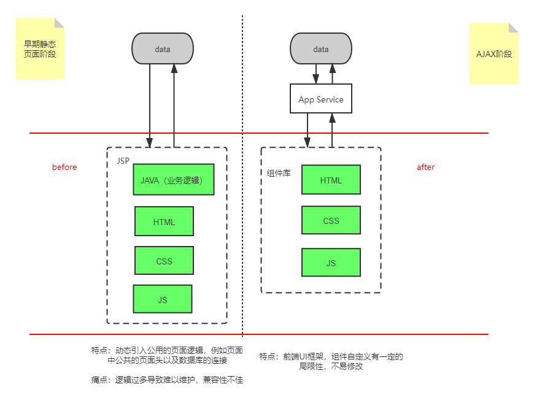

## 前端这个行业是如何发展起来的? 是做什么的?

这一切还得从互联网发展早期说起，1993年，美国伊利诺伊大学NCSA 开发了Mosaic 浏览器，1994年则可以称作前端历史的起点，这一年Tim Berners-Lee 创建了W3C、网景推出了第一版Navigator、Tim的基友发布CSS、为动态web 网页设计的服务端脚本PHP。

### 1.早期静态页面阶段

随着各大浏览器相互之间的纷争，浏览器也逐渐普及起来，互联网早期的前后端开发是一体的，前端代码是后端代码的一部分，当时后端是MVC 的开发模式，前端只是后端MVC 模式中的V。

那时的前端工程师，严格意义来讲是模板工程师，主要负责编写页面模板，譬如我们熟知的 Java 系列的 FreeMarker，还有 ASP 、 PHP 等。

### 2.AJAX阶段

2005 年初，Ajax的广泛使用推动了前后端的分离，Ajax 全称 Asynchronous JavaScript and XML，即异步JS 与 XML。它最早在IE5中被使用，然后由Mozilla、Google 推广开。典型的代表应用有谷歌地图以及GMail，这在当时是一个跨时代的突破，用户在不主动刷新页面的情况下就可以更新页面的状态，这极大地提高了网站用户的体验。

早期静态页面阶段和AJAX阶段的对比如下：

由于早期静态页面阶段的轻前端重后端的思想，产品经理如果想要很炫的页面效果，前端实现起来比较复杂且难以阅读。Ajax的出现则解决了这种场景需求，在Ajax异步请求的基础上推出了许多JS框架，比如JQuery-UI， easy-UI，以及大名鼎鼎的ExtJS。这种JS框架使得前端组件化提高了一个高度，在开发效率方面，框架里利用封装DOM，Ajax交互实现了一个个很炫的组件，开发者只需简单引入配置即可实现产品经理想要的效果；在性能优化方面，这些JS交互都是在浏览器运行，因此也大大减少了服务器压力。

### 3.前端 MVC 阶段
前端脚本具备读写数据、处理数据、生成视图等功能，页面需求开始变得复杂起来。此时，前端生态迫切需要开发出轮子工具，目的是便利开发者来管理他们的代码，“时势造英雄”，属于前端的 MVC 框架诞生了。

前端MVC模式主要分为三部分：

* 视图（View）：用户界面
* 控制器（Controller）：业务逻辑
* 模型（Model）：数据模型

View 作为用户界面，发送指令给 Controller，Controller 要求 Model 改变状态，同时 Model 把更新过的数据发送给 View 反馈给用户。

2010年，第一个前端 MVC 框架 Backbone.js 诞生，此后，也有其他前端MVC模式框架出现。

### 4.前端 MVVM阶段
MVVM 同样是一种软件架构模式，它是在 MVC 的基础上演进过来的，去掉了 MVC 中的 Controller，这个模式的特点是 View 绑定着 View Model，假设View Model中的数据发生了改变，View也随之改变，反之亦然。

前端MVVM模式主要分为四部分：

View层：视图展示。包含UI View以及UI View Controller，View层是可以持有View Model的。

View Model层：视图适配器。暴露属性与View元素显示内容或者元素状态一一对应。一般情况下View Model暴露的属性建议是readOnly的，View持有View Model，View Model不能依赖UI的任何属性。有两个原因：一是为了View Model可测性，即单元测试方便进行，这也是上图提到MVVM的可测试性；二是团队人员可分离开发，也是低解耦性的体现。

Model层：数据模型与持久化抽象模型。数据模型就是从服务器请求回来的JSON数据。而持久化抽象模型暂时放在Model层，是因为MVVM诞生之初就没有对这块进行很细致的描述。按照经验，我们在业务开发时通常把数据库操作、文件操作封装成Model，并对外提供操作接口。

Binder：MVVM中的核心概念。如果MVVM没有Binder，那么它与MVC的差异不是很大。

最能代表MVVM模式的框架便是Google 公司推出的 Angular，它的核心概念便是数据的双向绑定。往后的框架借助MVVM模式的思想也逐渐迸发，在2016年中，前端框架经过多次迭代发展，业界逐渐形成三足鼎立的局势：

React 由Facebook开发，使用方式是最接近原生JavaScript

Vue 由华人程序员尤雨溪开发，以上手简单著称

Angular 上面提过，由谷歌开发，由第一代框架Angular发展而来，以大而全著称

### 5.SPA阶段
从Ajax出现之后，我们可以在当前页面获取到数据，并局部更新页面数据，但页面的切换会导致整个页面又将重新渲染，这会出现页面加载缓慢的问题，有新问题就有动力造新轮子，我能否通过Ajax和路由管理来更新页面呢？

因此，便出现了 SPA(single-page application)，它就是指在一个网页（single page）上，模拟出多个页面应用程序（application）。客户端只需要将网页载入一次（首屏渲染），其余所有的操作都将在这张页面上完成。

### 6.SSR阶段

SPA解决了很多问题，但从渲染方面，SPA阶段的客户端渲染（client side render）无法做搜索引擎优化；从性能方面，用户对应用点击以及跳转的响应时间要求越来越高，在SPA阶段提到的首屏渲染过慢也影响着用户的体验。

于是，大家便争先恐后的做起了服务端渲染，当然，现在的服务端渲染和之前的还是有区别的，之前的服务端渲染基本只需要处理从模板转到html字符串的转换，性能要优于现在的服务端渲染。现在的服务端渲染是以组件为中心，组件统一通过模块构建工具如webpack一并处理，开发效率和可维护性更高。

### 7.新阶段

1. Node & 全栈

2009年，Ryan Dahl在谷歌浏览器的Javascript引擎（V8引擎）的基础上实现了更多功能，使Javascript拥有了独立于浏览器的运行环境，这就是Node，它的出现令前端开发拥有了控制服务器的能力。例如，阿里开源的egg.js和360奇舞团开源的Think.js。

2. 小程序的出现

随着国内网民的手机普及率的增加，代表着移动互联网的到来，各大互联网的流量不断地迸发，这股流量促使着小程序的诞生，这也代表着国内技术创新的小程序走上了世界技术的前沿。紧跟微信之后， 百度、阿里、字节跳动、360、小米、华为纷纷推出自己的小程序。

3. 内外双修

如今，前端领域处于一个“内外双修”的阶段，在对内中，前端领域内借鉴后端微服务的理念，提出了微前端，它是将不同的业务按照不同的维度拆解为多个子应用，通过主应用来加载这些子应用。例如，2019年 qiankun基于Single-SPA, 提供了更加开箱即用的 API，它做到了技术栈无关，并且接入简单。TypeScript的出现约束了JavaScript的书写格式，它拥有诸多优点，TypeScript通过对代码进行类型检查，可以帮助我们避免在编写JavaScript时经常遇到的令人痛苦的错误。

在对外中，谷歌开发的框架flutter，只需写一份代码，就能在多个端（IOS、Android）运行；针对运维领域的serverless，它让开发者不需要关注服务器运维，可以专注于业务逻辑的开发。

4. 效率至上

近几年前端生态已经不断壮大，前端框架的Vue3和React 18，前端打包工具的vite和turboPack，但能感受到这两年，前端的新轮子也不再那么高频率出现了，就连几个核心框架，更新的内容也都开始挤牙膏了，甚至是互相借鉴。
目前的前端大框架已经定成，如今已经往各个垂直领域不断发展，聚焦核心场景不断探索。

就当下各个垂直领域的技术（Solid.js、Svelte、Remix、Astro、Vite、Bun、Tauri、Turbo、Rspack等）进行总结，围绕性能、运行时、体积、Rust四方面分别讲解，具体如下。

（1）性能

1. Webpack的启动时间过慢，促使了swc、esbuild这些编译器，以及Turbo、Vite、Rspack（基于 Rust 的高性能构建引擎,具备与 Webpack 生态系统的互操作性,可以被 Webpack 项目低成本集成,并提供更好的构建性能）这样的基于新编译器的构建方式。

2. 配置太多，促使了约定大于配置或0配置的开箱即用

3. 包太大，促使了pnpm的包管理工具。

4. 模块拆分，诞生了Lerna 和 Yarn/ pnpm workspace。

（2）运行时

目前主流的仍是Node和Deno， 2022年最火的一个项目是Bun.sh，官方介绍Bun是一个快的JavaScript运行时，且内置包管理。基于Zig和uWebSockets，性能是极好的。

未来的js Runtime可能会是集合支持network import，自带包管理，原生支持Typescript。

（3）体积

SSR就是减少体积的实现方式，从SSR到SSG，前端对于体积方面也在不断优化。诸如Astro对于体积的优化，Astro默认在不传任何东西的情况下，它返回给客户端的体积是0KB，你没听错，是0KB！

在跨端构建方案中，也出现了tauri，它Rust编写的跨端构建方案，优点是基于Web技术可以打出比Electron更小的包。体积小10倍以上。tauri主要由TAO（TAO是创建跨平台应用窗口的库，支持所有主要平台，除了PC，还有iOS和Android）,WRY（WRY是基于Tao构建的跨平台Webview渲染库）,tauri Runtime以及其生态。

**Tauri和Electron的优劣：**

构建优化：Tauri 内部架构使用的tao和wry使用各个操作系统的内置Webview，而不是像Electron内置Chromium。在安装包大小上，Tauri胜出

兼容性：tao和wry使用的Webview兼容性是个大问题，会不会出现ie6类的兼容问题不好说。Electron则是对所有平台展示一样的效果。

（4）rust是前端必学？

Rust 语言在前端工具链的影响越来越大，上面说的Tauri，Bun，Rspack等都是基于rust语言构建。可以说之前实现的生态链，rust都重现了一遍。
