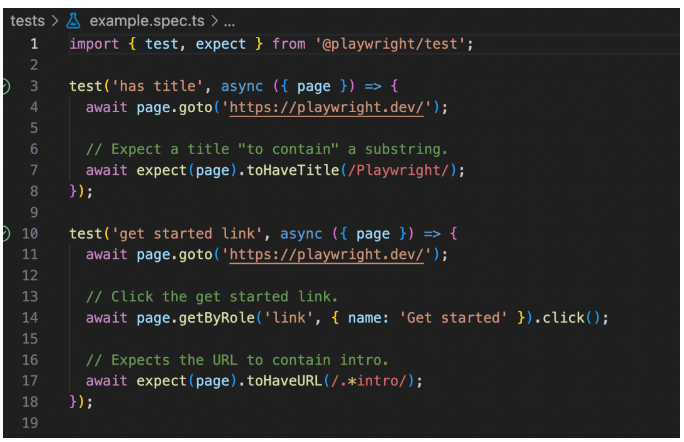
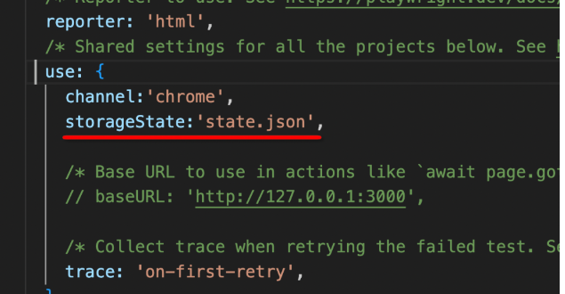

### playwright 介绍
是一个端到端（`E2E`）测试框架， 它可在所有现代浏览器中运行功能强大的测试和自动化。支持多种编程语言 API， 包括 JavaScript 、 TypeScript, Python, .NET 和 Java。正因为它基于浏览器，相当于模拟用户真实操作，因此不光能够用来跑测试用例，还可以用来写爬虫。


### 初始化项目
如果项目中没有安装`Playwright NPM` 包，或者重新开始一个新的测试项目，需要可以在 vscode 命令面板中输入intsll Playwright

这里我选择 chromium，这样可以只下载一个浏览器内核。点击OK后，插件会帮我们自动初始化程序， 初始化出对应的目录结构

### 项目配置
生成了`playwright.config.ts`，有许多参数配置，例如可以配置`worker`，使用多少个子进程来跑测试

### 使用
所有的测试用例都要写在 tests 文件夹中，默认有一个测试文件，包含有 2 个测试用例，代码在example.spec.ts中。


### 实用1 - 添加 cookie
测试的系统往往需要登录，而在运行每个测试用例之前运行，都需要登录，这肯定是繁琐的，因此我们可以在运行测试用例之前，手动拷贝 cookies，注入到浏览器中。

比如掘金的每日签到和抽奖，我就可以使用 Playwright 来实现自动化

首先建立一个测试文件
```js
import { test, expect, type Page } from "@playwright/test";

test("登录", async ({page, context}) => {
    await context.addCookies([
        {
            name: "sessionid",
            value: "xxx",
            path: "/",
            domain: ".juejin.cn",
        },
        {
            name: "sessionid_ss",
            value: "xxx",
            path: "/",
            domain: ".juejin.cn",
        },
    ]);
    await page.goto("https://juejin.cn/");
});
```

打开 chrome 控制台，复制 cookies， 添加到代码中。此时点击左侧运行的测试用例，发现已经是登录状态。

### 录制一个测试用例
如果要手动去查找 dom ，从零开始写一个测试用例肯定是繁琐的，因此 Playwright VSCode 插件提供了录制功能。

运行上一次测试用例后，浏览器是未关闭的。此时我们点击 vscode 左侧的 Record new 按钮，vscode 便会自动创建一个测试文件，并且记录操作步骤。

录制时，浏览器又是一个全新的，不保留任何状态，那如果我们要测试的是登录后的功能，岂不是又要登录？ 其实 playwright 可以保存登录状态。

在上面测试用例后加一句 storageState。
```js
import { test, expect, type Page } from "@playwright/test";

test("登录", async ({page, context}) => {
    await context.addCookies([
        {
            name: "sessionid",
            value: "xxx",
            path: "/",
            domain: ".juejin.cn",
        },
        {
            name: "sessionid_ss",
            value: "xxx",
            path: "/",
            domain: ".juejin.cn",
        },
    ]);
    await page.goto("https://juejin.cn/");
+   await context.storageState({ path: 'state.json' });
});
```
并且在 playwright.config.ts 中，配置存储位置。



以下便是录制后的代码。

```js
import { test, expect } from '@playwright/test';

test('test', async ({ page }) => {
  await page.goto('https://juejin.cn/');
  await page.getByRole('button', { name: '去签到' }).click();
  await page.getByRole('button', { name: '立即签到' }).click();
  await page.getByRole('button', { name: '去抽奖' }).click();
  await page.getByText('免费抽奖次数：1次').click();
  await page.getByRole('button', { name: '收下奖励' }).click();
});
```
录制完成后，直接运行代码可能会报错，我们需要调整一下，因为有些文本是异步请求实现的，有些事件是请求成功后绑定的，在手动录制时，因为已经响应完成，因此没问题，我们加上 2 句延迟。 不过这些就是额外的优化了

### 断言
通过expect完成断言判断，保证程序的正常运作
```js
    await expect(page.locator("#turntable-item-0")).toHaveText(
      `免费抽奖次数：${res.data.free_count}次`
    );
```