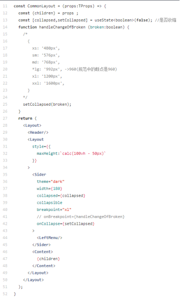
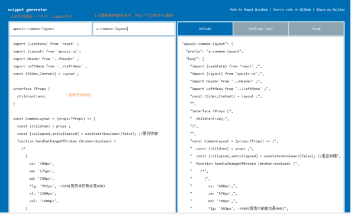
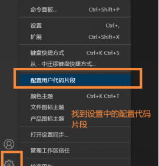
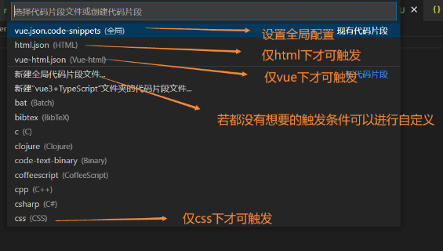
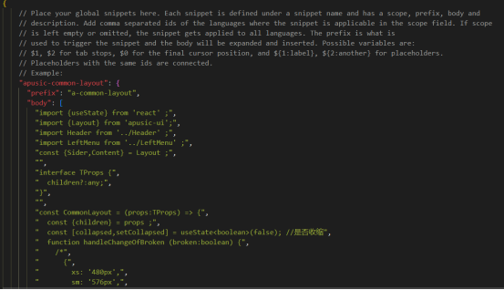

## 在VScode自定义配置代码片段
### 前言
众所周知如React等在创建页面需要手动补充十分麻烦，对于常用的典型页面，例如表格+搜索框和表单创建等，感谢我们强大的Vscode为我们单独开辟出自定义的小天地，教程如下：

### 1.定义自己常用的代码片段

### 2.通过转码链接进转译
复制自己的代码片段并进入下方的转码链接：
> 转码链接：https://snippet-generator.app/

最后点击“code snippet”拷贝
### 3.Vscode中设置

### 4.在项目中使用
输入a-common-layout既可创建