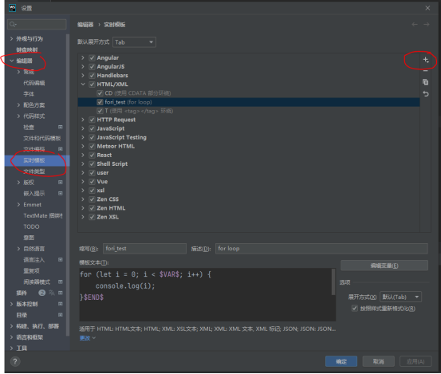
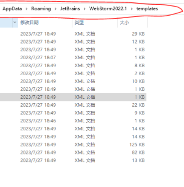

### 1.步骤

要自定义代码片段，请按照以下步骤操作：
1. 打开WebStorm，按下ctrl+alt+s。
2. 在左侧的"Live Templates"（实时模板）窗格中，可以看到WebStorm默认提供的许多代码片段模板。你可以选择其中一个模板，然后点击右侧的"+"按钮来创建一个新的代码片段。
3. 在弹出的对话框中，填写以下信息来配置代码片段：

Abbreviation：代码片段的缩写，用来触发该代码片段的插入。

Template text：代码片段的实际内容，即你想要插入的代码。你可以使用变量、模板语法等来定制代码片段。

Description：对代码片段的简要描述，用来帮助你记忆这个代码片段的用途。

Applicable in：代码片段适用的上下文范围，比如JavaScript、HTML等。

Edit variables：可以编辑和添加变量，并在代码片段中引用它们。

5. 配置完成后，点击"Apply"或"OK"保存设置。
### 2.例子
以下是一些常用的变量和模板语法：

1.变量：
* END：代码片段结束的位置。
* SELECTION：如果有选中文本，则表示选中文本的位置，否则表示END的位置。
* $VAR$：自定义变量，可以在代码片段中使用，并在插入时进行替换。

2.模板语法：
* $END$：设置光标结束位置。
* $SELECTION$：插入选中文本。
* $var$：插入自定义变量。

### 3.共享配置
在下面的路径模板找到配置找到自定义的xml文件配置，其他组员在复用时直接粘贴到对应电脑的路径下即可，并重启webstorm即可

路径模板：
C:\Users\<YourUserName>\AppData\Roaming\JetBrains\WebStorm<version>\templates

如果以上的路径仍然无法找到，你还可以在WebStorm内部查找配置文件位置，你可以通过下列步骤找到：
1. 打开WebStorm，点击菜单栏的 "Help" 或 "帮助"
2. 选择 "Edit Custom Properties..." 或 "编辑自定义属性..."
3. WebStorm会弹出一个对话框，按照提示在配置文件夹中创建一个新的 idea.properties 文件，或者选择一个现有的文件进行编辑。
4. 此时你的文件管理器应该已经打开了WebStorm的配置目录。