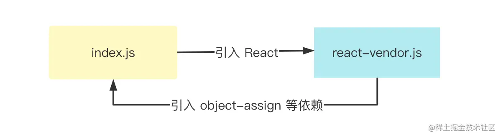
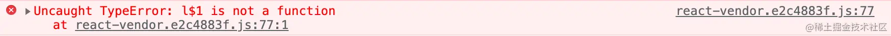

我们使用rollup的manualChunks自定义打包react和react-dom
```json5
{
  build: {
    rollupOptions: {
      output: {
        // manualChunks 配置
        manualChunks: {
          // 将 React 相关库打包成单独的 chunk 中
          'react-vendor': ['react', 'react-dom'],
        },
      },
    }
  },
}
```
但这样在生产环境会报错

react-vendor为什么需要引用index.js的代码呢？其实也很好理解，我们之前在manualChunks中仅仅将路径包含 react 的模块打包到react-vendor中，殊不知，像object-assign这种 react 本身的依赖并没有打包进react-vendor中，而是打包到另外的 chunk 当中

### 解决思路
1. 确定 react 相关包的入口路径。
2. 在 manualChunks 中拿到模块的详细信息，向上追溯它的引用者，如果命中 react 的路径，则将模块放到 react-vendor中。