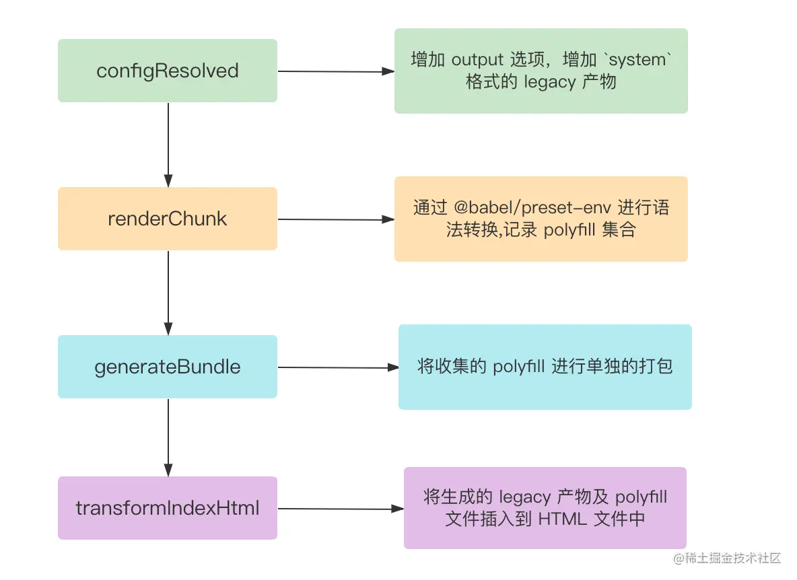

1. 首先是在configResolved钩子中调整了output属性，这么做的目的是让 Vite 底层使用的打包引擎 Rollup 能另外打包出一份Legacy 模式的产物

2. 接着，在`renderChunk`阶段，插件会对 `Legacy` 模式产物进行语法转译和 `Polyfill` 收集，值得注意的是，这里并不会真正注入Polyfill，而仅仅只是收集Polyfill（可以使用 `@babel/preset-env` 的`useBuiltIns: 'usage'`来进行全局 `Polyfill` 的收集）

3. 接下来会进入`generateChunk`钩子阶段，现在 `Vite` 会对之前收集到的`Polyfill`进行统一的打包，实现也比较精妙，主要逻辑集中在`buildPolyfillChunk`函数中。

其中，通过 vite build 对renderChunk中收集到 polyfill 代码进行打包，生成一个单独的 chunk;
```ts
const res = await build({
   // ....
    // 这里的插件实现了一个虚拟模块
    // Vite 对于 polyfillId 会返回所有 Polyfill 的引入语句
  plugins: [polyfillsPlugin(imports, externalSystemJS)],
    build: {
      rollupOptions: {
        // 访问 polyfillId
        input: {
          // name 暂可视作`polyfills-legacy`
          // pofyfillId 为一个虚拟模块，经过插件处理后会拿到所有 Polyfill 的引入语句
          [name]: polyfillId
        },
      }
    }
})
```
4. 现在我们已经能够拿到 Legacy 模式的产物文件名及 Polyfill Chunk 的文件名，那么就可以通过transformIndexHtml钩子来将这些产物插入到 HTML 的结构中
