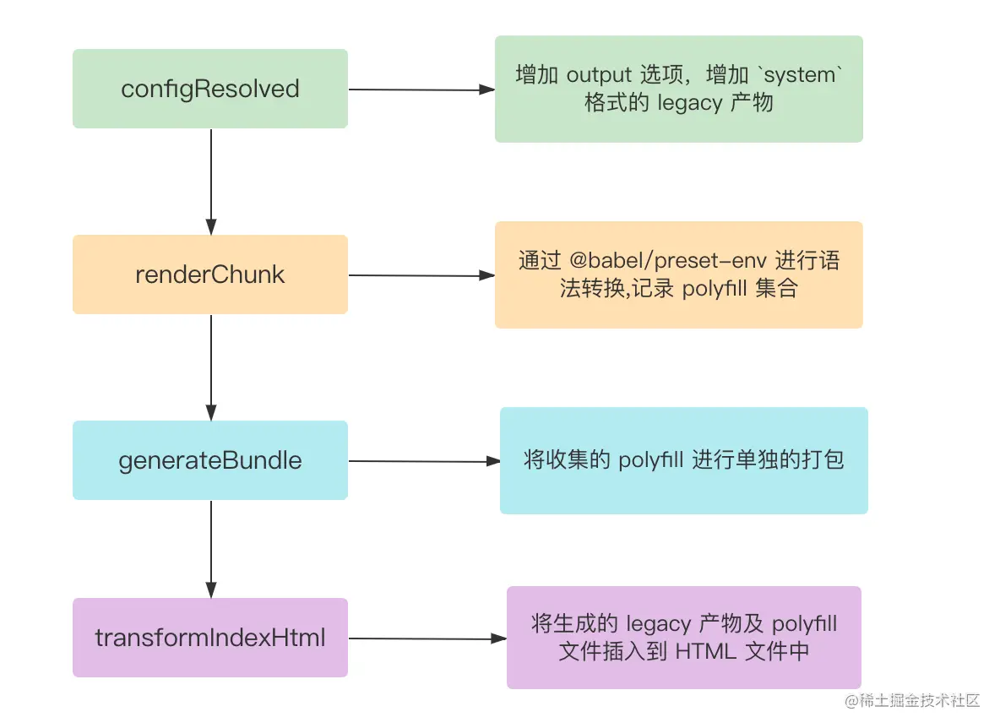

架构图

### 性能利器——Esbuild
#### 一、依赖预构建——作为 Bundle 工具
首先是开发阶段的依赖预构建阶段。

Esbuild 的性能实属太恐怖，它基于go语言编写，可以理解为比起node.js的语言，go的性能提升5倍，内存减少40%
，详细的可以看这篇[文章](https://blog.csdn.net/csdnnews/article/details/124979161)

#### Esbuild 作为打包工具的缺点
* 不支持降级到 ES5 的代码。这意味着在低端浏览器代码会跑不起来。
* 不支持 const enum 等语法。这意味着单独使用这些语法在 esbuild 中会直接抛错。
* 不提供操作打包产物的接口，像 Rollup 中灵活处理打包产物的能力(如renderChunk钩子)在 Esbuild 当中完全没有。
* 不支持自定义 Code Splitting 策略。传统的 Webpack 和 Rollup 都提供了自定义拆包策略的 API，而 Esbuild 并未提供，从而降级了拆包优化的灵活性。

#### 二、单文件编译——TS 和 JSX 编译工具
在依赖预构建阶段， Esbuild 作为 Bundler 的角色存在。而在 TS(X)/JS(X) 单文件编译上面，Vite 也使用 Esbuild 进行语法转译，也就是将 Esbuild 作为 Transformer 来用。大家可以在架构图中Vite Plugin Pipeline部分注意到:

#### 三、代码压缩——作为压缩工具
从架构图中可以看到，在生产环境中 Esbuild 压缩器通过插件的形式融入到了 Rollup 的打包流程中:

传统的方式都是使用 Terser 这种 JS 开发的压缩器来实现，在 Webpack 或者 Rollup 中作为一个 Plugin 来完成代码打包后的压缩混淆的工作。但 Terser 其实很慢，主要有 2 个原因。

1. 压缩这项工作涉及大量 AST 操作，并且在传统的构建流程中，AST 在各个工具之间无法共享，比如 Terser 就无法与 Babel 共享同一个 AST，造成了很多重复解析的过程。
2. JS 本身属于解释性 + JIT（即时编译） 的语言，对于压缩这种 CPU 密集型的工作，其性能远远比不上 Golang 这种原生语言。

因此，Esbuild 这种从头到尾共享 AST 以及原生语言编写的 Minifier 在性能上能够甩开传统工具的好几十倍。

### 总结
Vite 将 Esbuild 作为自己的性能利器，将 Esbuild 各个垂直方向的能力(Bundler、Transformer、Minifier)利用的淋漓尽致，给 Vite 的高性能提供了有利的保证。
