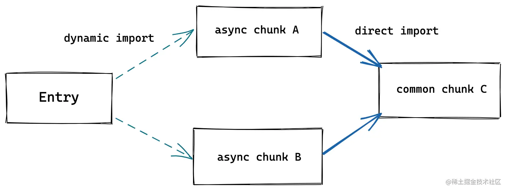

在生产环境的Bundle，主要拓展和优化了三个方面：
1. CSS 代码分割。如果某个异步模块中引入了一些 CSS 代码，Vite 就会自动将这些 CSS 抽取出来生成单独的文件，提高线上产物的缓存复用率。

2. 自动预加载。Vite 会自动为入口 chunk 的依赖自动生成预加载标签<link rel="moduelpreload"> ，如:`
``` html
<head>
  <!-- 省略其它内容 -->
  <!-- 入口 chunk -->
  <script type="module" crossorigin src="/assets/index.250e0340.js"></script>
  <!--  自动预加载入口 chunk 所依赖的 chunk-->
  <link rel="modulepreload" href="/assets/vendor.293dca09.js">
</head>
```
这种适当预加载的做法会让浏览器提前下载好资源，优化页面性能。

3. 异步 Chunk 加载优化。

在异步引入的 Chunk 中，通常会有一些公用的模块，如现有两个异步引入的 Chunk: A 和 B，而且两者有一个公共依赖 C，如下图:

   一般情况下，Rollup 打包之后，会先请求 A，然后浏览器在加载 A 的过程中才决定请求和加载 C，但 Vite 进行优化之后，请求 A 的同时会自动预加载 C，通过优化 Rollup 产物依赖加载方式节省了不必要的网络开销。

