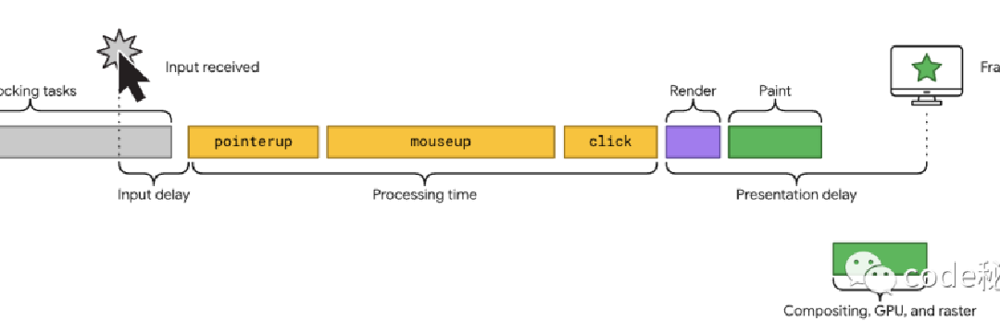

## 1. 浏览器-新的性能指标
### 下次绘制交互 (INP)
下次绘制交互 (INP) 是一项新的指标，浏览器计划于 2024 年 3 月将其取代取代首次输入延迟 (FID) ，成为最新的 Web Core Vitals

`INP` 是一种指标，通过观察用户访问页面的整个生命周期中发生的所有单击、敲击和键盘交互的延迟来评估页面对用户交互的整体响应能力。

交互是在同一逻辑用户手势期间触发的一组事件处理程序。例如，触摸屏设备上的 “点击” 交互包括多个事件，例如 pointerup、pointerdown 和 click。交互可以由 JavaScript、CSS、内置浏览器控件或其组合驱动。

交互的延迟就是由驱动交互的这一组事件处理程序的单个最长持续时间组成的，从用户开始交互到渲染下一帧视觉反馈的时间。

INP 考虑的是所有页面的交互，而首次输入延迟 (FID) 只会考虑第一次交互。而且它只测量了第一次交互的输入延迟，而不是运行事件处理程序所需的时间或下一帧渲染的延迟。

浏览器希望使用 INP 替代 FID 就意味着用户的交互体验越来越重要了，我们常常听到的时间切片的概念，实际上就是为了提升网页的交互响应能力。